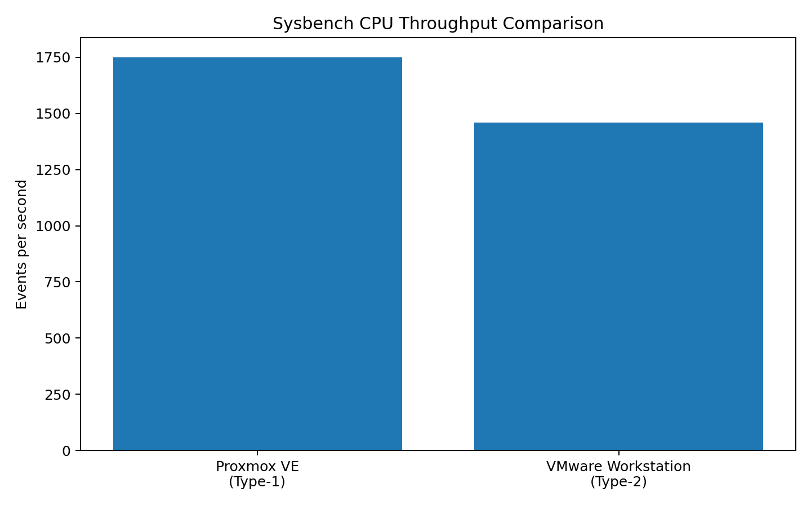
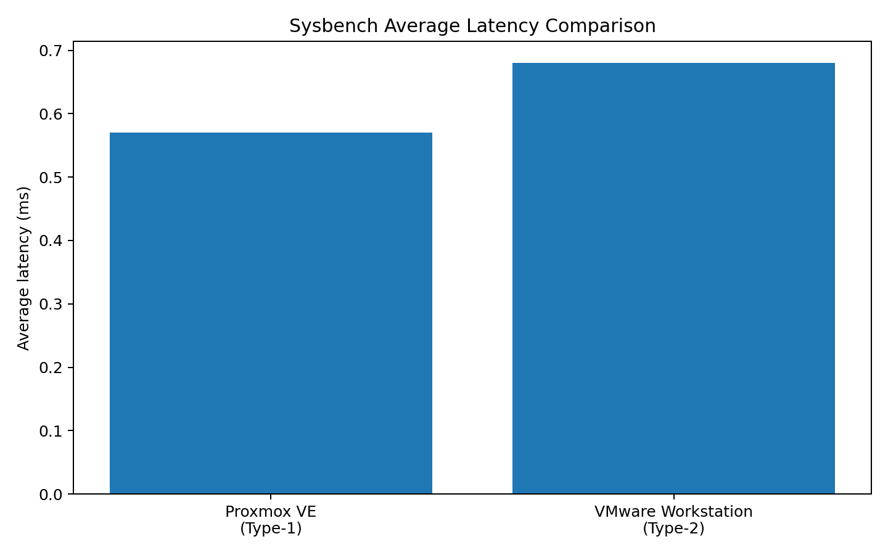
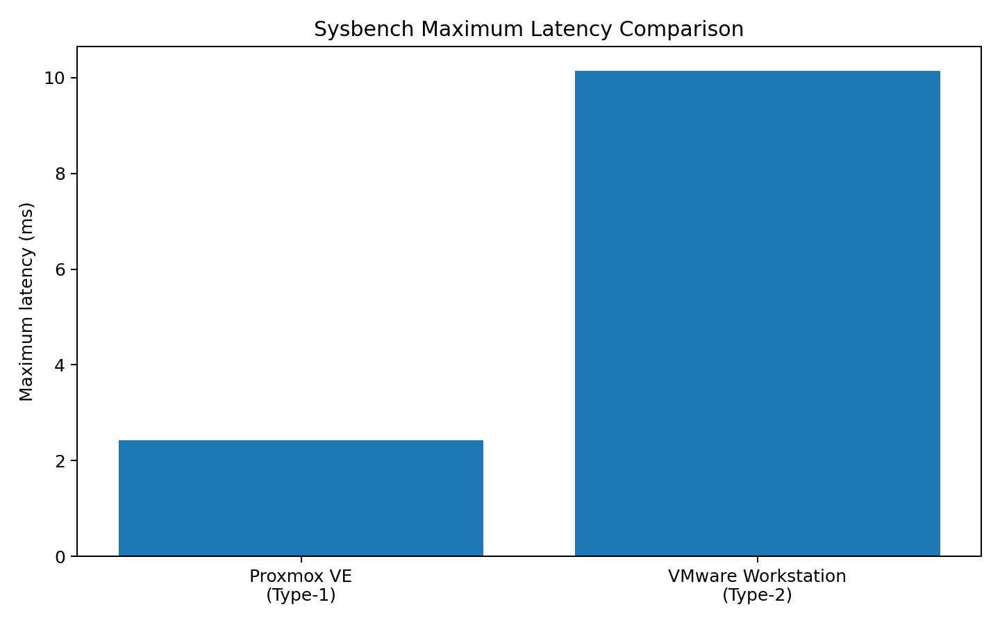

# Performance Analysis of Type-1 and Type-2 Hypervisors

**Proxmox VE (Type-1) vs VMware Workstation (Type-2)**  
**Experiment:** CPU performance analysis using Sysbench

## 1. Objective

This repository documents a laboratory comparison of a virtual machine running on:

- **Proxmox VE — Type-1 hypervisor**
- **VMware Workstation — Type-2 hypervisor**

The experiment follows the supplied lab manual. Both VMs were configured with approximately **2 vCPU, 2 GB RAM and 20 GB virtual disk**, and the CPU benchmark used was:

```bash
sysbench cpu --cpu-max-prime=20000 run
```

The lab manual specifies recording total execution time, total events, events per second and latency statistics, followed by resource observations. 

## 2. Repository contents

```text
hypervisor-performance-analysis/
│
├── README.md
├── .gitignore
│
├── data/
│   └── performance_results.csv
│
├── analysis/
│   ├── performance_analysis.md
│   └── methodology.md
│
├── charts/
│   ├── events_per_second.png
│   ├── average_latency.png
│   └── maximum_latency.png
│
└── evidence/
    ├── Type-1-Proxmox-results.pdf
    ├── Type-2-VMware-results.pdf
    ├── type1/
    │   ├── 01.png
    │   ├── 02.png
    │   └── ...
    └── type2/
        ├── 01.png
        ├── 02.png
        └── ...
```

## 3. Experimental configuration

| Parameter | Proxmox VE | VMware Workstation |
|---|---|---|
| Hypervisor type | Type-1 | Type-2 |
| Guest OS | Ubuntu 24.04.3 LTS | Ubuntu 24.04.x LTS |
| vCPU allocation | 2 vCPU | 2 vCPU |
| RAM allocation | 2 GB | 2 GB |
| Virtual disk | 20 GB | 20 GB |
| Benchmark | Sysbench CPU | Sysbench CPU |
| Prime limit | 20,000 | 20,000 |
| Threads | 1 | 1 |

## 4. Observed benchmark results

| Metric | Proxmox VE | VMware Workstation |
|---|---:|---:|
| Total execution time (s) | 10.0005 | 10.0001 |
| Total events | 17,494 | 14,602 |
| Events/sec | **1,749.16** | **1,460.03** |
| Minimum latency (ms) | 0.57 | 0.65 |
| Average latency (ms) | **0.57** | **0.68** |
| Maximum latency (ms) | 2.43 | 10.14 |
| 95th percentile latency (ms) | 0.58 | 0.75 |

### Quick interpretation

For these particular runs:

- Proxmox recorded about **19.8% more events/sec** than VMware.
- Proxmox recorded about **16.2% lower average latency**.
- Proxmox recorded a lower maximum latency in this run.
- The execution times are both approximately 10 seconds because the benchmark was run for the same workload/time window.

**Important:** These observations describe the supplied experimental runs. They should not be presented as proof that the hypervisor type alone caused the difference.

## 5. Important experimental limitation

The screenshots show that the underlying CPU environments are **not identical**.

The Type-2 evidence exposes a **13th Gen Intel Core i5-1335U** to the guest, while the Proxmox host evidence shows a different host CPU environment. Therefore, the comparison is useful as a laboratory observation, but it is **not a fully controlled hypervisor-only experiment**.

A strong evaluation statement is:

> "The VM resource allocations and Sysbench workload were kept equivalent, but the underlying host environments were not identical. Hence, the measured difference is an observed performance difference for these configurations, not an isolated measurement of hypervisor overhead."

This limitation should be stated explicitly rather than hidden.

## 6. Charts

### Events per second



### Average latency



### Maximum latency



## 7. Evidence

### Type-1 — Proxmox VE

The complete evidence is available in:

- [`Type-1-Proxmox-results.pdf`](evidence/Type-1-Proxmox-results.pdf)
- [`type1/`](evidence/type1/)

The evidence includes VM configuration, Ubuntu verification, resource observations, Sysbench output and Proxmox resource monitoring.

### Type-2 — VMware Workstation

The complete evidence is available in:

- [`Type-2-VMware-results.pdf`](evidence/Type-2-VMware-results.pdf)
- [`type2/`](evidence/type2/)

The evidence includes `lscpu`, memory/disk checks, Sysbench output and other VM observations.

## 8. Reproducibility

 

### What it will look like

**Verify Ubuntu OS**  
`hostnamectl`

**Verify CPU configuration**  
`lscpu`

**Verify memory**  
`free -h`

**Verify disk space**  
`df -h`

**Monitor system resources**  
`top`

**Update Ubuntu packages**  
`sudo apt update`

**Install Sysbench**  
`sudo apt install sysbench -y`

**Verify Sysbench installation**  
`sysbench --version`

**Run CPU performance benchmark**  
`sysbench cpu --cpu-max-prime=20000 run`

**Shut down the virtual machine**  
`sudo poweroff`

This is the correct Markdown structure if you want the **description lighter and the actual command darker**, while keeping the typography consistent.

 


Record:

- total execution time
- total events
- events/sec
- minimum latency
- average latency
- maximum latency
- 95th percentile latency

## 9. How to read the result

For CPU throughput:

**Higher events/sec = more benchmark events completed per second.**

For latency:

**Lower latency = less time per benchmark event.**

Do not compare only one number. Read throughput and latency together and consider the experimental conditions.

## 10. Conclusion

Under the supplied experimental runs, Proxmox VE produced higher Sysbench CPU throughput and lower average latency than VMware Workstation. However, the underlying CPU environments differ, so the result should be reported as an observation from this lab setup rather than a universal statement about Type-1 versus Type-2 hypervisors.


